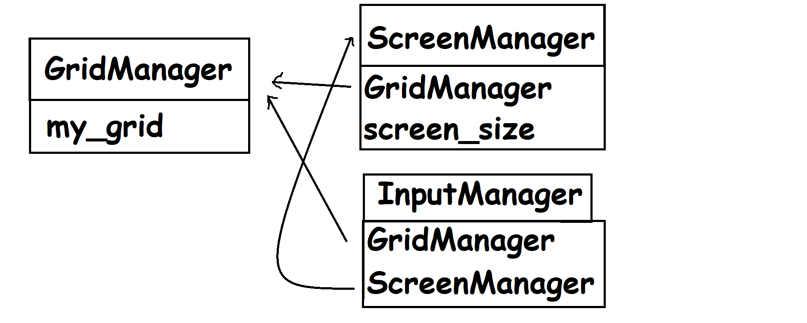

# Arkkitehtuurikuvaus

Projektin arkkitehtuuri on varsin yksinkertainen, sillä projekti on vielä alussa.

Ruudukkomanageri on projektin sydän ja hoitaa lähes kaiken relevantin logiikan.
Näyttömanageri hoitaa annetun ruudukon piirtämisen näytölle. Tätä varten sille annetaan Ruudukkomanagerin tiedot luettaviksi.
Näppäimistömanageri pystyy vaikuttamaan ruudukkomanageriin ja näyttömanagerin fullscreen muuttujaan. Pystyy myös sulkemaan sovelluksen.

