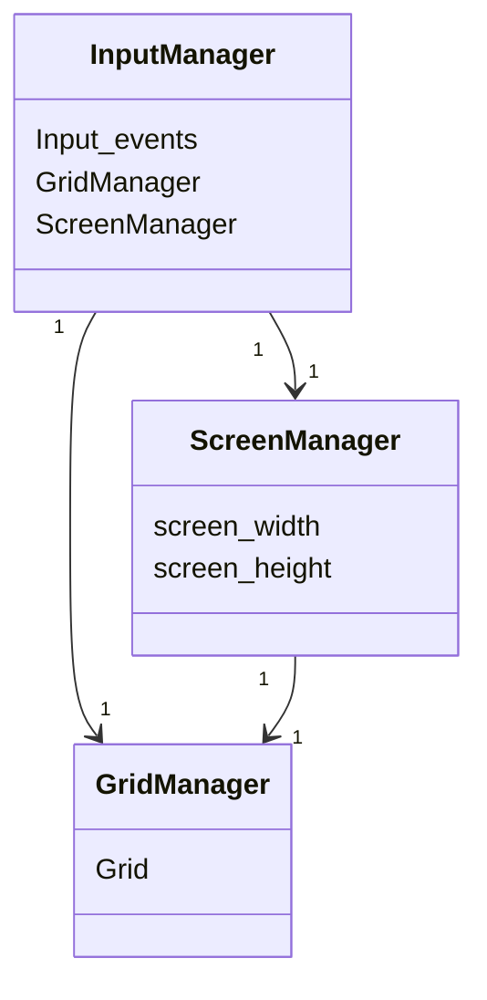

#Luokkadiagrammi

```mermaid
 classDiagram
      InputManager "1" --> "1" ScreenManager
      InputManager "1" --> "1" GridManager
      ScreenManager "1" --> "1" GridManager
      class GridManager{
          Grid
      }
      class ScreenManager{
          screen_width
          screen_height
      }
      class InputManager{
          Input_events
          GridManager
          ScreenManager
      }
```